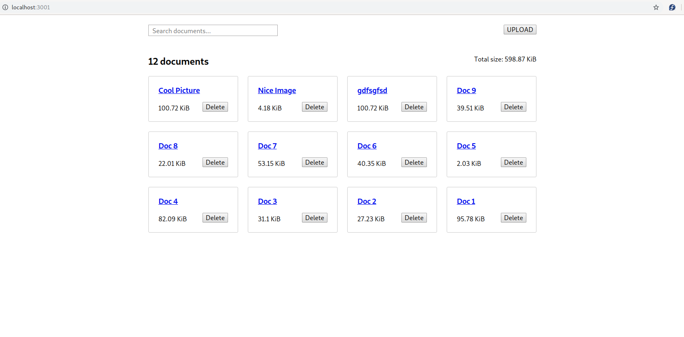

# George - 12/07/2019



This repository contains the front-end and the back-end for a simple Document Uploading Web application. 

While the backend actually stores uploaded documents on disk, it keeps document metadata in an in-memory database that is reset every time the server restarts.

The uploaded images are stored in the directory `web/uploads`.

## Installation

To run this application you need to have `nodejs 10.16` and `Go 1.12` installed on your system. For installation instructions please check here:

* [Nodejs](https://nodejs.org/en/download/)
* [Go](https://golang.org/doc/install)

Then, you can run the included build script to install further dependencies and build the front-end and the back-end.

```sh
./scripts/build.sh
```

### Development mode execution

To run the application in *development mode*, open two terminals. In the first terminal give the following command:

```sh
go run cmd/backend/main.go
```

This starts the backend server that serves the API endpoints and the document files.

In the second terminal give:

```sh
cd web/app
npm i # only once
npm run start
```

This starts a development server that serves the frontend Web application at http://localhost:3001

### Production mode build and execution

To run the application in *production mode*, open two terminals. In the first terminal give the following command:

```sh
cd cmd/backend
go build
./backend
```

This starts the backend server that serves the API endpoints and the document files.

In the second terminal give:

```sh
pushd web/app
npm i # only once
npm run build
popd
cd cmd/frontend
go build
./frontend
```

This starts a server that serves the frontend Web application at http://localhost:3001

### Running the tests

For the back-end:

```sh
go test ./...
```

For the front-end:

```sh
cd web/app
npm run test
```

## Security

For security reasons we try to minimize external dependencies.

We depend on React's automatic escaping of interpolated strings, to mitigate XSS attacks.

On the backend, we explicitly verify that the uploaded documents are actually `PNG` or `JPEG` files. We also restrict the file-size to 10MiB. Moreover, we validate that the documen title is valid.

We use a random id for the filename of the uploaded files, both to mitigate some attacks and make the files less discoverable.

We avoid using the default HTTP server offered in the Go stdlib. We instantiate a properly configured HTTP server.

## Improvements

* Store the uploaded documents on 'blobstore', e.g. S3, Google Cloud Storage etc.
* Store the document metadata in a Relational Database (e.g. Postgres) or a Document Store (e.g. Firestore)
* Support pagination in the document grid (offset, limit)
* More refactored CSS
* Additional hardening of the backend
  * Request throtling.
* Add extensive logging and monitoring both at the backend and frontend.
* Add a Dockerfile
* Use Snapshot Testing with Jest

## Libraries

### Back-end

We use one external dependency:

* `go-nanoid`: A tiny, secure, URL-friendly, unique string ID generator.   

### Front-end

The only libraries used in production are `react` and `react-dom`.

Development-only dependencies include:

* `typescript`: Static-typing catches many bugs and allows for superior development ergonomics (IDEs), and more readable and maintainable code.

* `react-scripts`: Easy boostrapping of a React applications that follow best-practices.

## API

The backend implements a simple REST API. On success, the corresponding resource are returned (encoded in JSON format). On failure, a JSON response containing an error description is returned instead. The Status Code of the response is set accordingly.

### GET /api/v1/documents?q={query}

Get a list of all documents stored on the service. This endpoint supports additional options passed as query-string parameters.

* `q`: only return the documents with a title matching the value of the `q` parameter.

Returns a list of documents in JSON format, for example:

```
HTTP/1.1 200 OK
Access-Control-Allow-Credentials: true
Access-Control-Allow-Headers: Access-Control-Allow-Headers, Origin,Accept, X-Requested-With, Content-Type, Access-Control-Request-Method, Access-Control-Request-Headers, Pragma, Cache-Control, Authorization
Access-Control-Allow-Methods: HEAD, GET, POST, PUT, PATCH, DELETE, OPTIONS
Access-Control-Allow-Origin: http://localhost:3001
Content-Type: application/json; charset=utf-8
Date: Thu, 11 Jul 2019 12:52:35 GMT
Content-Length: 1636
Connection: close

[
  {
    "id": "9n6a5hMzTKXJu6CCmdkjqj",
    "title": "Doc 9",
    "path": "uploads/dummy.jpg",
    "size": 40456,
    "time": "2019-07-11T15:43:20.870463653+03:00"
  },
  {
    "id": "cqh2hEkW0OE8_zTL9dPfxD",
    "title": "Doc 2",
    "path": "uploads/dummy.jpg",
    "size": 27887,
    "time": "2019-07-11T15:43:20.862667244+03:00"
  },
  {
    "id": "O0vvloodDNXUEr7u4VadOo",
    "title": "George",
    "path": "/uploads/O0vvloodDNXUEr7u4VadOo.jpg",
    "size": 103134,
    "time": "2019-07-11T15:43:33.342352653+03:00"
  },
]
```

### POST /api/v1/documents

Upload a new document to the service. This a `multipart/form-data` request, with two parameters:

* `title`: The document title
* `docfile`: The file of the document

```
Content-Type: multipart/form-data; boundary=----WebKitFormBoundaryoLNLjP3A7RoB87LD
Origin: http://localhost:3001
Referer: http://localhost:3001/
User-Agent: Mozilla/5.0 (X11; Linux x86_64) AppleWebKit/537.36 (KHTML, like Gecko) Chrome/75.0.3770.100 Safari/537.36
```

Returns the created document in JSON format, for example:

```
Access-Control-Allow-Credentials: true
Access-Control-Allow-Headers: Access-Control-Allow-Headers, Origin,Accept, X-Requested-With, Content-Type, Access-Control-Request-Method, Access-Control-Request-Headers, Pragma, Cache-Control, Authorization
Access-Control-Allow-Methods: HEAD, GET, POST, PUT, PATCH, DELETE, OPTIONS
Access-Control-Allow-Origin: http://localhost:3001
Content-Length: 152
Content-Type: application/json; charset=utf-8
Date: Thu, 11 Jul 2019 12:56:20 GMT

{
    "id": "nEpzXkYE5_UxbERc4hkuNX",
    "title": "Image",
    "path": "/uploads/nEpzXkYE5_UxbERc4hkuNX.jpg",
    "size": 103134,
    "time": "2019-07-11T15:56:20.763232651+03:00"
}
```

On failure returns an error message, for example:

```
Request URL: http://localhost:3000/api/v1/documents
Request Method: POST
Status Code: 422 Unprocessable Entity
Remote Address: [::1]:3000
Referrer Policy: no-referrer-when-downgrade
Access-Control-Allow-Credentials: true
Access-Control-Allow-Headers: Access-Control-Allow-Headers, Origin,Accept, X-Requested-With, Content-Type, Access-Control-Request-Method, Access-Control-Request-Headers, Pragma, Cache-Control, Authorization
Access-Control-Allow-Methods: HEAD, GET, POST, PUT, PATCH, DELETE, OPTIONS
Access-Control-Allow-Origin: http://localhost:3001
Content-Length: 35
Content-Type: application/json; charset=utf-8
Date: Thu, 11 Jul 2019 18:31:49 GMT

{
    "error": "invalid document title"
}
```

### DELETE /api/v1/documents?id={id}

Remove the document with the specific id from the service.

On success returns an empty response, for example:

```
Access-Control-Allow-Credentials: true
Access-Control-Allow-Headers: Access-Control-Allow-Headers, Origin,Accept, X-Requested-With, Content-Type, Access-Control-Request-Method, Access-Control-Request-Headers, Pragma, Cache-Control, Authorization
Access-Control-Allow-Methods: HEAD, GET, POST, PUT, PATCH, DELETE, OPTIONS
Access-Control-Allow-Origin: http://localhost:3001
Content-Length: 3
Content-Type: application/json; charset=utf-8
Date: Thu, 11 Jul 2019 13:06:26 GMT

{}
```

On failure returns an error message, for example:

```
HTTP/1.1 404 Not Found
Access-Control-Allow-Credentials: true
Access-Control-Allow-Headers: Access-Control-Allow-Headers, Origin,Accept, X-Requested-With, Content-Type, Access-Control-Request-Method, Access-Control-Request-Headers, Pragma, Cache-Control, Authorization
Access-Control-Allow-Methods: HEAD, GET, POST, PUT, PATCH, DELETE, OPTIONS
Access-Control-Allow-Origin: http://localhost:3001
Content-Type: application/json; charset=utf-8
Date: Thu, 11 Jul 2019 13:16:51 GMT
Content-Length: 31
Connection: close

{
  "error": "document not found"
}
```

NOTE: A better API would be:

`DELETE /api/v1/documents/{id}`

but such urls are not supported by the default `Mux` included in Go's standard library and we wanted to avoid an external dependency.

## Miscellanea

### Code Style and Code Layout

We strive to use the 'official' code style of both languages used in the implementation. Please, note that Golang, promotes the use of small identifiers etc. For Golang we use the standard `gofmt` formatter. For TypeScript we use the VSCode formatter with minor tweaks (e.g. no semicolons).

We use the directory structure described here:

<https://github.com/golang-standards/project-layout>

The architecture of the backend, loosely follows ideas described here:

<https://gokit.io/faq/#architecture-and-design>

### Git

For Git commit messages, we follow Golang Team's conventions as described here:

<https://golang.org/doc/contribute.html#commit_messages>

A 'monorepo' aproach is used, where both the API service and the front-end Web app are organized in a single-repo, mainly for simplicity. The two code-bases can be separated at a later stage, if needed.

### CSS

We use the [BEM methodology](https://en.bem.info/) for CSS styles, mostly to disable the 'cascading' feature of CSS, which is considered an anti-pattern these days.

### Why use broker instead of Redux/MobX.

In previous projects I used a custom flux-style state manager based on [RxJS](https://github.com/ReactiveX/rxjs). It wasn't easy to switch to Redux within the time constrains, so I implemented a simple pub-sub `broker` that in coordination with the `DocumentStore` implement the 'unidirectional flow' pattern advocated by Flux/Redux etc. IMO, it's a simple, easy to understand solution, that's apropriate for this exercise.
